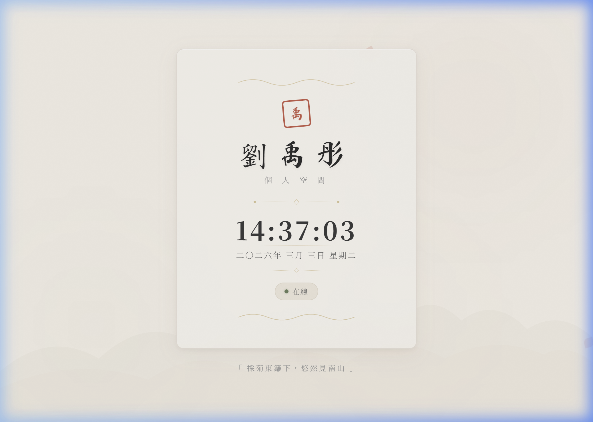

# Overview

Today, we developed and deployed a minimalist ancient-style personal webpage for **劉禹彤**. The project involved creating a high-quality frontend with traditional Chinese aesthetics and setting up a professional version control workflow with GitHub.

**Live Demo:** [https://liouyutong.github.io/0303_hw1/](https://liouyutong.github.io/0303_hw1/)



---

## ✨ Features

- **即時動態時鐘** — 每秒更新的時間顯示，搭配中文日期格式（如「二〇二六年 三月 三日 星期二」）
- **水墨暈染背景** — 三層水墨暈染動畫緩慢浮動，營造宣紙上的水墨效果
- **飄落花瓣動畫** — 隨機生成的粉色花瓣從畫面頂端緩緩飄落
- **古風印章設計** — 朱紅色方印搭配微傾斜角度，還原傳統篆刻風格
- **詩句自動輪播** — 頁面底部每 8 秒切換一句經典古詩名句，淡入淡出過渡
- **遠山水墨剪影** — SVG 繪製的山巒輪廓作為背景裝飾層
- **響應式設計** — 自適應手機與桌面裝置的不同螢幕尺寸
- **玻璃擬態卡片** — 半透明毛玻璃效果卡片，搭配懸停浮起互動

---

## 🎨 Design System

| Element | Value |
|---------|-------|
| Background | `#f5f0e8` (宣紙米白) |
| Primary Text | `#2c2c2c` (墨色) |
| Accent Color | `#c45c4a` (朱紅) |
| Gold Accent | `#b8963e` (古銅金) |
| Status Green | `#6b7f5e` (竹綠) |
| Display Font | Ma Shan Zheng (馬善政書法體) |
| Serif Font | Noto Serif TC (思源宋體) |

---

## 🛠️ Tech Stack

- **HTML5** — 語意化頁面結構
- **Vanilla CSS3** — 自適應屬性與關鍵幀動畫
- **Vanilla JavaScript** — 原生 JS 實現時鐘與特效
- **Google Fonts** — 載入中文字體

---

## � File Structure

```
L1/
├── index.html   # Page structure and semantic HTML
├── style.css    # All styling: layout, typography, animations
├── script.js    # Live clock logic + petal animation
├── preview.png  # Webpage preview image
└── README.md    # This file
```
